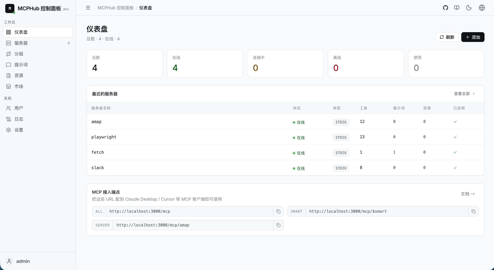
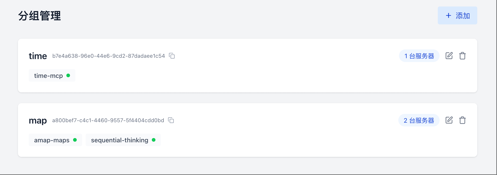

[English](README.md) | Français | [中文版](README.zh.md)

# MCPHub : Le Hub Unifié pour les Serveurs MCP (Model Context Protocol)

MCPHub facilite la gestion et la mise à l'échelle de plusieurs serveurs MCP (Model Context Protocol) en les organisant en points de terminaison HTTP streamables (SSE) flexibles, prenant en charge l'accès à tous les serveurs, à des serveurs individuels ou à des groupes de serveurs logiques.



## ⚠️ AVERTISSEMENT DE SÉCURITÉ

**IMPORTANT** : Avant de déployer MCPHub en production, vous **DEVEZ** configurer les paramètres de sécurité pour empêcher les accès non autorisés.

🔒 **Actions requises** :
1. **Activer l'authentification Bearer** dans Paramètres → Configuration des Routes
2. **Changer le mot de passe admin par défaut** (`admin`/`admin123`)
3. **Désactiver l'option `skipAuth`**
4. **Déployer derrière un reverse proxy** (Nginx, Traefik, etc.)
5. **Ne jamais exposer directement sur Internet** sans authentification appropriée

📖 **Lire l'analyse de sécurité complète** : [SECURITY.md](SECURITY.md)

⚡ **TL;DR** : Par défaut, les endpoints MCP ne sont PAS authentifiés sauf si vous activez explicitement Bearer Auth. Toute personne connaissant le nom de votre serveur peut accéder à vos serveurs MCP sans authentification.

---

## 🌐 Démo en direct et Documentation

- **Documentation** : [docs.mcphubx.com](https://docs.mcphubx.com/)
- **Environnement de démo** : [demo.mcphubx.com](https://demo.mcphubx.com/)

## 🚀 Fonctionnalités

- **Support étendu des serveurs MCP** : Intégrez de manière transparente n'importe quel serveur MCP avec une configuration minimale.
- **Tableau de bord centralisé** : Surveillez l'état en temps réel et les métriques de performance depuis une interface web élégante.
- **Gestion flexible des protocoles** : Compatibilité totale avec les protocoles MCP stdio et SSE.
- **Configuration à chaud** : Ajoutez, supprimez ou mettez à jour les serveurs MCP à la volée, sans temps d'arrêt.
- **Contrôle d'accès basé sur les groupes** : Organisez les serveurs en groupes personnalisables pour une gestion simplifiée des autorisations.
- **Authentification sécurisée** : Gestion des utilisateurs intégrée avec contrôle d'accès basé sur les rôles, optimisée par JWT et bcrypt.
- **Prêt pour Docker** : Déployez instantanément avec notre configuration conteneurisée.

## 🔧 Démarrage rapide

### Configuration

Créez un fichier `mcp_settings.json` pour personnaliser les paramètres de votre serveur :

```json
{
  "mcpServers": {
    "amap": {
      "command": "npx",
      "args": ["-y", "@amap/amap-maps-mcp-server"],
      "env": {
        "AMAP_MAPS_API_KEY": "votre-clé-api"
      }
    },
    "playwright": {
      "command": "npx",
      "args": ["@playwright/mcp@latest", "--headless"]
    },
    "fetch": {
      "command": "uvx",
      "args": ["mcp-server-fetch"]
    },
    "slack": {
      "command": "npx",
      "args": ["-y", "@modelcontextprotocol/server-slack"],
      "env": {
        "SLACK_BOT_TOKEN": "votre-jeton-bot",
        "SLACK_TEAM_ID": "votre-id-équipe"
      }
    }
  }
}
```

### Déploiement avec Docker

**Recommandé** : Montez votre configuration personnalisée :

```bash
docker run -p 3000:3000 -v ./mcp_settings.json:/app/mcp_settings.json -v ./data:/app/data samanhappy/mcphub
```

Ou exécutez avec les paramètres par défaut :

```bash
docker run -p 3000:3000 samanhappy/mcphub
```

### Accéder au tableau de bord

Ouvrez `http://localhost:3000` et connectez-vous avec vos identifiants.

> **Note** : Les identifiants par défaut sont `admin` / `admin123`.

**Aperçu du tableau de bord** :

- État en direct de tous les serveurs MCP
- Activer/désactiver ou reconfigurer les serveurs
- Gestion des groupes pour organiser les serveurs
- Administration des utilisateurs pour le contrôle d'accès

### Point de terminaison HTTP streamable

> Pour le moment, la prise en charge des points de terminaison HTTP en streaming varie selon les clients IA. Si vous rencontrez des problèmes, vous pouvez utiliser le point de terminaison SSE ou attendre les futures mises à jour.

Connectez les clients IA (par exemple, Claude Desktop, Cursor, DeepChat, etc.) via :

```
http://localhost:3000/mcp
```

Ce point de terminaison fournit une interface HTTP streamable unifiée pour tous vos serveurs MCP. Il vous permet de :

- Envoyer des requêtes à n'importe quel serveur MCP configuré
- Recevoir des réponses en temps réel
- Intégrer facilement avec divers clients et outils IA
- Utiliser le même point de terminaison pour tous les serveurs, simplifiant votre processus d'intégration

**Routage intelligent (expérimental)** :

Le routage intelligent est le système de découverte d'outils intelligent de MCPHub qui utilise la recherche sémantique vectorielle pour trouver automatiquement les outils les plus pertinents pour une tâche donnée.

```
http://localhost:3000/mcp/$smart
```

**Comment ça marche** :

1.  **Indexation des outils** : Tous les outils MCP sont automatiquement convertis en plongements vectoriels et stockés dans PostgreSQL avec pgvector.
2.  **Recherche sémantique** : Les requêtes des utilisateurs sont converties en vecteurs et comparées aux plongements des outils en utilisant la similarité cosinus.
3.  **Filtrage intelligent** : Des seuils dynamiques garantissent des résultats pertinents sans bruit.
4.  **Exécution précise** : Les outils trouvés peuvent être directement exécutés avec une validation appropriée des paramètres.

**Prérequis pour la configuration** :


Pour activer le routage intelligent, vous avez besoin de :

- PostgreSQL avec l'extension pgvector
- Une clé API OpenAI (ou un service de plongement compatible)
- Activer le routage intelligent dans les paramètres de MCPHub

**Points de terminaison spécifiques aux groupes (recommandé)** :



Pour un accès ciblé à des groupes de serveurs spécifiques, utilisez le point de terminaison HTTP basé sur les groupes :

```
http://localhost:3000/mcp/{group}
```

Où `{group}` est l'ID ou le nom du groupe que vous avez créé dans le tableau de bord. Cela vous permet de :

- Vous connecter à un sous-ensemble spécifique de serveurs MCP organisés par cas d'utilisation
- Isoler différents outils IA pour n'accéder qu'aux serveurs pertinents
- Mettre en œuvre un contrôle d'accès plus granulaire pour différents environnements ou équipes

**Points de terminaison spécifiques aux serveurs** :
Pour un accès direct à des serveurs individuels, utilisez le point de terminaison HTTP spécifique au serveur :

```
http://localhost:3000/mcp/{server}
```

Où `{server}` est le nom du serveur auquel vous souhaitez vous connecter. Cela vous permet d'accéder directement à un serveur MCP spécifique.

> **Note** : Si le nom du serveur et le nom du groupe sont identiques, le nom du groupe aura la priorité.

### Point de terminaison SSE (obsolète à l'avenir)

Connectez les clients IA (par exemple, Claude Desktop, Cursor, DeepChat, etc.) via :

```
http://localhost:3000/sse
```

Pour le routage intelligent, utilisez :

```
http://localhost:3000/sse/$smart
```

Pour un accès ciblé à des groupes de serveurs spécifiques, utilisez le point de terminaison SSE basé sur les groupes :

```
http://localhost:3000/sse/{group}
```

Pour un accès direct à des serveurs individuels, utilisez le point de terminaison SSE spécifique au serveur :

```
http://localhost:3000/sse/{server}
```

## 🧑‍💻 Développement local

```bash
git clone https://github.com/samanhappy/mcphub.git
cd mcphub
pnpm install
pnpm dev
```

Cela démarre à la fois le frontend et le backend en mode développement avec rechargement à chaud.

> Pour les utilisateurs de Windows, vous devrez peut-être démarrer le serveur backend et le frontend séparément : `pnpm backend:dev`, `pnpm frontend:dev`.

## 🛠️ Problèmes courants

### Utiliser Nginx comme proxy inverse

Si vous utilisez Nginx pour inverser le proxy de MCPHub, assurez-vous d'ajouter la configuration suivante dans votre configuration Nginx :

```nginx
proxy_buffering off
```

## 🔍 Stack technique

- **Backend** : Node.js, Express, TypeScript
- **Frontend** : React, Vite, Tailwind CSS
- **Authentification** : JWT & bcrypt
- **Protocole** : Model Context Protocol SDK

## 👥 Contribuer

Les contributions de toute nature sont les bienvenues !

- Nouvelles fonctionnalités et optimisations
- Améliorations de la documentation
- Rapports de bugs et corrections
- Traductions et suggestions

Rejoignez notre [communauté Discord](https://discord.gg/qMKNsn5Q) pour des discussions et du soutien.

## ❤️ Sponsor

Si vous aimez ce projet, vous pouvez peut-être envisager de :

[](https://ko-fi.com/samanhappy)

## 🌟 Historique des étoiles

[](https://www.star-history.com/#samanhappy/mcphub&Date)

## 📄 Licence

Sous licence [Apache 2.0 License](LICENSE).
