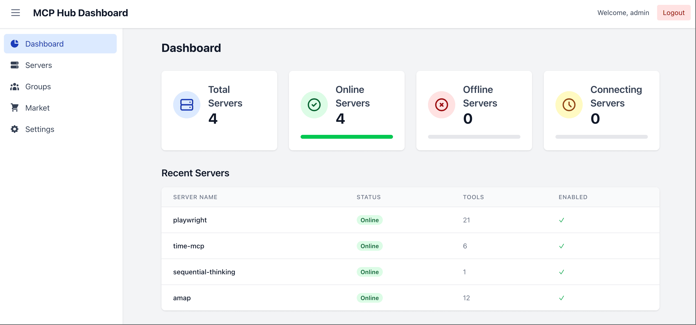

# MCPHub: Your Complete Model Context Protocol Hub

English | [中文版](README.zh.md)

MCPHub is an elegant, unified management platform that consolidates multiple MCP (Model Context Protocol) servers into a single, high-performance SSE endpoint. It transforms service management by offering a comprehensive interface for all your AI tool connectivity needs.



## 🚀 Key Features

- **Comprehensive MCP Server Integration**: Out-of-the-box support for popular MCP servers including `amap-maps`, `playwright`, `fetch`, `slack`, and more.
- **Unified Management Dashboard**: Intuitive web interface for monitoring real-time server status and performance metrics.
- **Smart Protocol Handling**: Seamless compatibility with both stdio and SSE MCP protocols, ensuring flexible connectivity options.
- **Dynamic Server Configuration**: Add, remove, or reconfigure MCP servers on-the-fly without service interruption.
- **Group-based Access Control**: Organize and manage server access with customizable server groups.
- **Secure Authentication**: Built-in user management system with role-based permissions.
- **Docker-ready Deployment**: Simple containerized setup for quick deployment in any environment.

## 🔧 Quick Start

### Configuration (Optional but Recommended)

Customize your MCP server settings by creating a `mcp_settings.json` file:

```json
{
  "mcpServers": {
    "amap-maps": {
      "command": "npx",
      "args": [
        "-y",
        "@amap/amap-maps-mcp-server"
      ],
      "env": {
        "AMAP_MAPS_API_KEY": "your-api-key"
      }
    },
    "playwright": {
      "command": "npx",
      "args": [
        "@playwright/mcp@latest",
        "--headless"
      ]
    },
    "fetch": {
      "command": "uvx",
      "args": [
        "mcp-server-fetch"
      ]
    },
    "slack": {
      "command": "npx",
      "args": [
        "-y",
        "@modelcontextprotocol/server-slack"
      ],
      "env": {
        "SLACK_BOT_TOKEN": "your-bot-token",
        "SLACK_TEAM_ID": "your-team-id"
      }
    }
  },
  "users": [
    {
      "username": "admin",
      "password": "$2b$10$Vt7krIvjNgyN67LXqly0uOcTpN0LI55cYRbcKC71pUDAP0nJ7RPa.",
      "isAdmin": true
    }
  ]
}
```

- The example includes several MCP servers with their configuration details. Add or remove servers based on your needs.
- The `users` section configures authentication. Default credentials: username `admin` with password `admin123`.
- Passwords are securely hashed with bcrypt. Generate a new password hash with:

  ```bash
  npx bcryptjs your-password
  ```

### Deployment Options

#### Using Docker (Recommended)

Launch MCPHub with default settings:

```bash
docker run -p 3000:3000 samanhappy/mcphub
```

Or with custom settings:

```bash
docker run -p 3000:3000 -v ./mcp_settings.json:/app/mcp_settings.json samanhappy/mcphub
```

#### Accessing the Dashboard

Navigate to `http://localhost:3000` in your browser and log in with your credentials (default: `admin`/`admin123`).

The dashboard provides:
- **Real-time Status Monitoring**: Live overview of all connected MCP servers
- **Server Management**: Enable/disable servers or modify their configuration
- **Group Management**: Organize servers into functional groups
- **User Administration**: Manage access permissions and user accounts

#### SSE Endpoint Integration

Connect your AI applications (Claude Desktop, Cursor, Cherry Studio, etc.) to MCPHub via the SSE endpoint at:
```
http://localhost:3000/sse
```

## 🧑‍💻 Local Development

### Clone the Repository

```bash
git clone https://github.com/samanhappy/mcphub.git
```

### Install Dependencies

```bash
cd mcphub && pnpm install
```

### Start Development Servers

```bash
pnpm dev
```

This launches both the backend and frontend in development mode with hot-reloading enabled.

## 🔍 Technical Details

MCPHub is built with:
- **Backend**: Node.js with Express, TypeScript
- **Frontend**: React, Vite, Tailwind CSS
- **Authentication**: JWT with bcrypt password hashing
- **MCP Protocol**: Based on the official Model Context Protocol SDK

## 👥 Community and Contributions

MCPHub started as a small side project and has grown thanks to community interest and support. While already quite functional, there are many areas for optimization and improvement.

Contributions are warmly welcomed, whether in the form of:
- Code improvements or new features
- Documentation enhancements
- Bug reports or fixes
- Translation assistance
- Feature suggestions

## 📄 License

This project is licensed under the [Apache 2.0 license](LICENSE).
