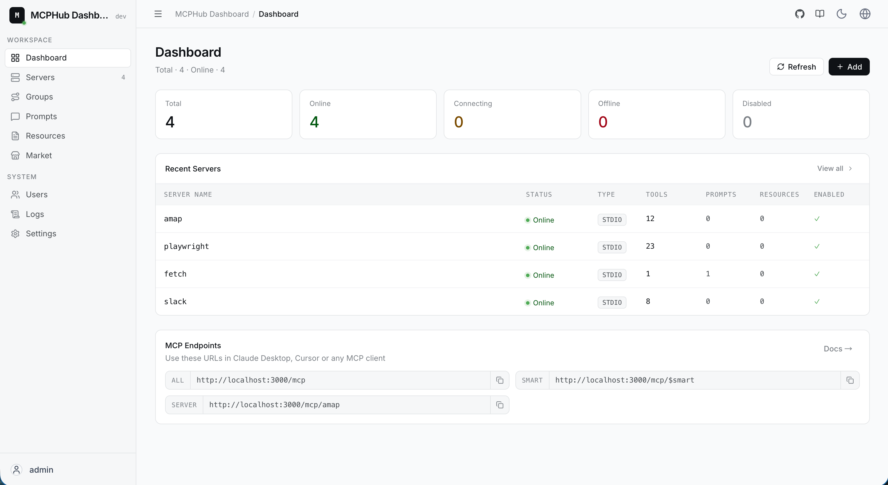

# MCPHub: Model Context Protocol (MCP) Sunuculari Icin Birlesik Merkez

Turkce | [English](README.md)

MCPHub, birden fazla MCP (Model Context Protocol) sunucusunu yonetmeyi ve olceklendirmeyi kolaylastirir. Sunuculari esnek Streamable HTTP (SSE) uzerinden; tum sunuculara, tekil sunuculara veya mantiksal sunucu gruplarina erisebileceginiz endpoint'ler halinde organize eder.



## 🌐 Dokumantasyon

- **GitHub**: [github.com/vaur94/mcphub](https://github.com/vaur94/mcphub)

## 🚀 Ozellikler

- **Merkezi Yonetim** - Tum MCP sunucularini tek bir panelden izleyin ve yonetin
- **Esnek Yonlendirme** - HTTP/SSE ile tum sunuculara, gruplara veya tekil sunuculara erisin
- **Akilli Yonlendirme** - Vektor semantik arama ile AI destekli arac kesfi
- **Canli Yapilandirma** - Sunuculari kesinti olmadan ekleyin/kaldirin/guncelleyin
- **OAuth 2.0 Destegi** - Guvenli kimlik dogrulama icin hem istemci hem sunucu modu
- **Sosyal Giris** - Better Auth entegrasyonu ile GitHub ve Google girisi (Database Mode gerektirir)
- **Database Mode** - Uretim ortamlarinda ayarlari PostgreSQL'de saklayin
- **Docker Uyumlu** - Konteyner ile hizlica kurulum ve dagitim

## 🔧 Hizli Baslangic

### Yapilandirma

Bir `mcp_settings.json` dosyasi olusturun:

```json
{
  "mcpServers": {
    "time": {
      "command": "npx",
      "args": ["-y", "time-mcp"]
    },
    "fetch": {
      "command": "uvx",
      "args": ["mcp-server-fetch"]
    }
  }
}
```

📖 OAuth, ortam degiskenleri ve daha fazlasi icin [Yapilandirma Rehberi](https://github.com/vaur94/mcphub) sayfasina bakin.

### Docker ile Dagitim

```bash
# Ozel config ile calistir (onerilir)
docker run -p 3000:3000 -v ./mcp_settings.json:/app/mcp_settings.json -v ./data:/app/data ghcr.io/vaur94/mcphub

# Ya da varsayilan ayarlarla calistir
docker run -p 3000:3000 ghcr.io/vaur94/mcphub
```

### Dashboard'a Erisim

`http://localhost:3000` adresini acin ve varsayilan bilgilerle giris yapin: `admin` / `admin123`

### AI Client Baglantisi

AI client'lari (Claude Desktop, Cursor, vb.) su endpoint'lerle baglayin:

```
http://localhost:3000/mcp                  # Tum sunucular
http://localhost:3000/mcp/{group}          # Belirli bir grup
http://localhost:3000/mcp/{server}         # Belirli bir sunucu
http://localhost:3000/mcp/$smart           # Akilli yonlendirme
http://localhost:3000/mcp/$smart/{group}   # Grup icinde akilli yonlendirme
```

> **Guvenlik notu**: MCP endpoint'leri varsayilan olarak kimlik dogrulama ister. Yanlislikla disari acilmayi engellemek icin bu davranis varsayilandir. Kimlik dogrulamasiz MCP erisimi icin Keys bolumunden **Enable Bearer Authentication** secenegini kapatin. **Skip Authentication** yalnizca dashboard girisini etkiler. Bunlari sadece guvenilir ortamlarda kullanin.

📖 Detayli endpoint dokumani icin [API Reference](https://github.com/vaur94/mcphub) sayfasina bakin.

## 📚 Dokumantasyon

| Konu                                                                           | Aciklama                          |
| ------------------------------------------------------------------------------ | --------------------------------- |
| [Quick Start](https://github.com/vaur94/mcphub)                             | 5 dakikada baslayin               |
| [Configuration](https://github.com/vaur94/mcphub)                           | MCP sunucu ayarlari               |
| [Database Mode](https://github.com/vaur94/mcphub)                           | Uretim icin PostgreSQL kurulumu   |
| [OAuth](https://github.com/vaur94/mcphub)                                   | OAuth 2.0 istemci ve sunucu ayari |
| [Smart Routing](https://github.com/vaur94/mcphub)                           | AI destekli arac kesfi            |
| [Docker Setup](https://github.com/vaur94/mcphub)                            | Docker dagitim rehberi            |

## 🧑‍💻 Yerel Gelistirme

```bash
git clone https://github.com/vaur94/mcphub.git
cd mcphub
pnpm install
pnpm dev
```

> Windows kullanicilari icin: backend ve frontend'i ayri ayri baslatin: `pnpm backend:dev`, `pnpm frontend:dev`

📖 Ayrintili kurulum icin [Development Guide](https://github.com/vaur94/mcphub) sayfasina bakin.

## 🔍 Teknoloji Yigini

- **Backend**: Node.js, Express, TypeScript
- **Frontend**: React, Vite, Tailwind CSS
- **Auth**: JWT ve bcrypt
- **Protocol**: Model Context Protocol SDK

## 👥 Katki

Katkilar memnuniyetle karsilanir. Issue veya pull request acabilirsiniz.

## 📄 Lisans

[Apache 2.0 Lisansi](LICENSE) ile lisanslanmistir.
