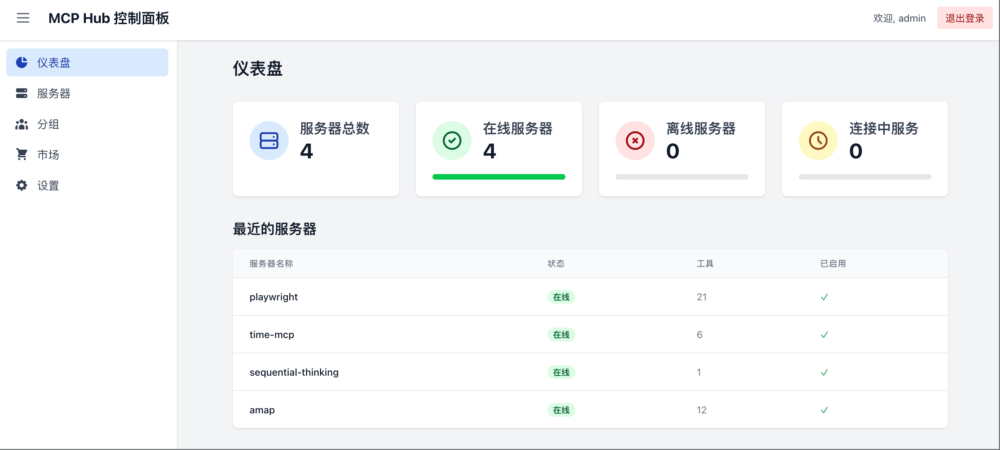

# MCPHub：一站式 MCP 服务管理平台

[English Version](README.md) | 中文版

MCPHub 是一个优雅、统一的管理平台，将多个 MCP（Model Context Protocol）服务整合为单一的高性能 SSE 端点。它通过提供全面的接口，彻底简化了 AI 工具连接管理，满足您所有的 MCP 服务需求。



## 🚀 核心功能

- **全面的 MCP 服务集成**：开箱即用支持众多热门 MCP 服务，包括 `amap-maps`、`playwright`、`fetch`、`slack` 等。
- **统一管理仪表盘**：直观的 Web 界面，实时监控服务器状态和性能指标。
- **智能协议处理**：无缝兼容 stdio 和 SSE MCP 协议，确保灵活的连接选项。
- **动态服务配置**：无需中断服务即可即时添加、移除或重新配置 MCP 服务。
- **基于分组的访问控制**：通过自定义服务器分组组织和管理服务访问权限。
- **安全认证系统**：内置用户管理系统，支持基于角色的权限控制。
- **Docker 快速部署**：简单的容器化设置，适用于任何环境的快速部署。

## 🔧 快速开始

### 配置（可选但推荐）

通过创建 `mcp_settings.json` 文件自定义 MCP 服务器设置：

```json
{
  "mcpServers": {
    "amap-maps": {
      "command": "npx",
      "args": [
        "-y",
        "@amap/amap-maps-mcp-server"
      ],
      "env": {
        "AMAP_MAPS_API_KEY": "your-api-key"
      }
    },
    "playwright": {
      "command": "npx",
      "args": [
        "@playwright/mcp@latest",
        "--headless"
      ]
    },
    "fetch": {
      "command": "uvx",
      "args": [
        "mcp-server-fetch"
      ]
    },
    "slack": {
      "command": "npx",
      "args": [
        "-y",
        "@modelcontextprotocol/server-slack"
      ],
      "env": {
        "SLACK_BOT_TOKEN": "your-bot-token",
        "SLACK_TEAM_ID": "your-team-id"
      }
    }
  },
  "users": [
    {
      "username": "admin",
      "password": "$2b$10$Vt7krIvjNgyN67LXqly0uOcTpN0LI55cYRbcKC71pUDAP0nJ7RPa.",
      "isAdmin": true
    }
  ]
}
```

- 示例包括多个 MCP 服务器及其配置详情，您可以根据需求添加或删除服务器。
- `users` 部分配置用户认证，默认凭据：用户名 `admin`，密码 `admin123`。
- 密码使用 bcrypt 安全哈希处理，可以使用以下命令生成新的密码哈希：

  ```bash
  npx bcryptjs your-password
  ```

### 部署选项

#### 使用 Docker（推荐）

使用默认设置启动 MCPHub：

```bash
docker run -p 3000:3000 samanhappy/mcphub
```

或使用自定义设置：

```bash
docker run -p 3000:3000 -v ./mcp_settings.json:/app/mcp_settings.json samanhappy/mcphub
```

#### 访问控制面板

在浏览器中访问 `http://localhost:3000` 并使用您的凭据登录（默认：`admin`/`admin123`）。

控制面板提供：
- **实时状态监控**：所有已连接 MCP 服务器的实时概览
- **服务器管理**：启用/禁用服务器或修改其配置
- **分组管理**：将服务器组织到功能分组中
- **用户管理**：管理访问权限和用户账户

#### SSE 端点集成

通过以下 SSE 端点将您的 AI 应用程序（如 Claude Desktop、Cursor、Cherry Studio 等）连接到 MCPHub：
```
http://localhost:3000/sse
```

## 🧑‍💻 本地开发

### 克隆仓库

```bash
git clone https://github.com/samanhappy/mcphub.git
```

### 安装依赖

```bash
cd mcphub && pnpm install
```

### 启动开发服务器

```bash
pnpm dev
```

这将同时启动前端和后端的开发模式，支持热重载。

## 🔍 技术细节

MCPHub 采用以下技术构建：
- **后端**：Node.js 与 Express、TypeScript
- **前端**：React、Vite、Tailwind CSS
- **认证**：JWT 与 bcrypt 密码哈希
- **MCP 协议**：基于官方 Model Context Protocol SDK

## 👥 社区与贡献

MCPHub 最初只是一个小型的个人项目，但得益于社区的兴趣和支持而不断成长。虽然功能已经相当完善，但仍有许多优化和改进的空间。

我们热忱欢迎各种形式的贡献：
- 代码改进或新功能
- 文档增强
- 错误报告或修复
- 翻译协助
- 功能建议


## 📄 许可证

本项目采用 [Apache 2.0 许可证](LICENSE)。
